# Resume AI, Claude Code For Getting Jobs



This repo keeps one editable source resume plus role-specific variants for applications.

## Core Files

- `sample-resume.html` - public sample resume source
- `resume.html` - private/local canonical resume source, ignored by git
- `sample-profile.md` - public sample profile inventory
- `PROFILE.md` - private/local broader source of truth for confirmed skills, projects, tools, and context, ignored by git
- `applications.md` - table of jobs applied to and the tailored resume used
- `<company>-<job-title>/resume.html` - role-specific resume variant
- `<company>-<job-title>/render_pdf.py` - PDF renderer for that variant
- `<company>-<job-title>/resume.pdf` - final PDF used for the application

## Process

1. If `resume.html` does not exist, ask the user to upload or paste an existing resume in DOCX, PDF, screenshot, or pasted-text form.
2. Convert the existing resume into `resume.html`, mostly replicating the original layout, typography, section order, spacing, and one-page format while making the content easy to edit.
3. If `PROFILE.md` does not exist, create it from the confirmed facts in `resume.html`, then expand it as the user confirms more detail.
4. Ask the user for job links they want to apply to.
5. If the user wants help finding roles, research job listings based on their preferences, such as target companies, role types, location, seniority, compensation, remote/on-site preference, and technologies.
6. Review `PROFILE.md` for confirmed context that may be relevant but is not visible in the one-page resume.
7. Review each job listing and identify the requirements that are genuinely supported by existing experience.
8. Ask a few targeted questions for each job to uncover missing but truthful details that would improve the tailored resume.
9. If those answers reveal new confirmed skills, tools, projects, metrics, or work history, add them to `PROFILE.md`.
10. Create a new subdirectory named for the company and role, then copy the resume into that folder as the tailored version.
11. Adjust wording, ordering, and emphasis to better match the posting while keeping every claim factually supported.
12. Add a row to `applications.md` with the company, role, posting URL, application date, and tailored resume path.
13. Render the tailored HTML resume to PDF.
14. Verify the PDF is exactly one page before using it.

## Agent Intake

When starting work in this repo, the agent should first determine which mode applies:

- If no canonical resume exists, ask the user for an existing resume to convert.
- If no `PROFILE.md` exists after the canonical resume is created, generate one from the resume and mark it as the current source of confirmed profile facts.
- If a canonical resume exists but no target role is provided, ask the user for job links or ask whether they want help researching roles.
- If the user wants role research, gather preferences before searching: target titles, industries, companies, locations, remote preference, seniority, compensation expectations, and technologies to emphasize or avoid.
- If job links are provided, use the links as the source of truth and tailor from there.
- For each job, ask a few high-signal questions before finalizing the tailored resume when the listing values experience that is not already clear from `PROFILE.md`.
- Add newly confirmed answers to `PROFILE.md` before using them in a resume.
- If a job listing is unavailable, closed, or unreadable, tell the user and avoid creating a speculative tailored resume unless they provide the listing text.

## Grounding Rules

- Do not invent experience, tools, metrics, or project scope.
- Prefer reordering and clarifying true experience over adding unsupported keywords.
- Ask for clarification when a posting values experience that is not already documented.
- Keep the canonical resume broadly accurate and stable; use job-specific folders for targeted variants.
- When a fact should apply everywhere, update both the canonical resume and any relevant tailored copies.
- When the user confirms new information about their skills, tools, projects, metrics, or work history, add it to `PROFILE.md` so future tailoring can use it.
- Treat `PROFILE.md` as inclusive and long-form; treat each resume as a focused one-page artifact.

## Tailoring Guidelines

Good tailoring usually means:

- Moving the most relevant projects or skills higher
- Rewriting bullets to use the same vocabulary as the posting when it is still accurate
- Making degrees and required qualifications explicit for ATS parsing
- Emphasizing matching experience such as `Python`, `ML infrastructure`, `model deployment`, `debugging`, or `distributed systems`
- Removing or de-emphasizing truthful but low-relevance material when it adds bloat or distracts from the role fit
- Preserving the complete personal-project portfolio by default, while reordering projects when a role makes one more relevant than another

Bad tailoring means:

- Adding unsupported technologies
- Claiming direct experience with a requirement that is only adjacent to past work
- Hiding important context just to force more keywords into the page
- Treating every resume as an additive superset instead of a focused version for one role
- Silently dropping portfolio links just to save space without an explicit reason

## PDF Generation

This repo uses Python plus Playwright to render HTML resumes to PDF because Chromium gives reliable print-CSS behavior and matches browser layout closely.

Example:

```powershell
cd .\ibm-software-engineer
python .\render_pdf.py
```

Each render script should:

- Load the local HTML file
- Print to letter-size PDF
- Use the page's print CSS
- Verify the final PDF page count is exactly `1`

## Application Tracking

Every application should be recorded in `applications.md`.

The table should include:

- Date applied
- Company
- Role
- Job URL
- Tailored resume used

This keeps a clear record of:

- Which roles were targeted
- Which resume version was submitted
- What wording was used for each application

